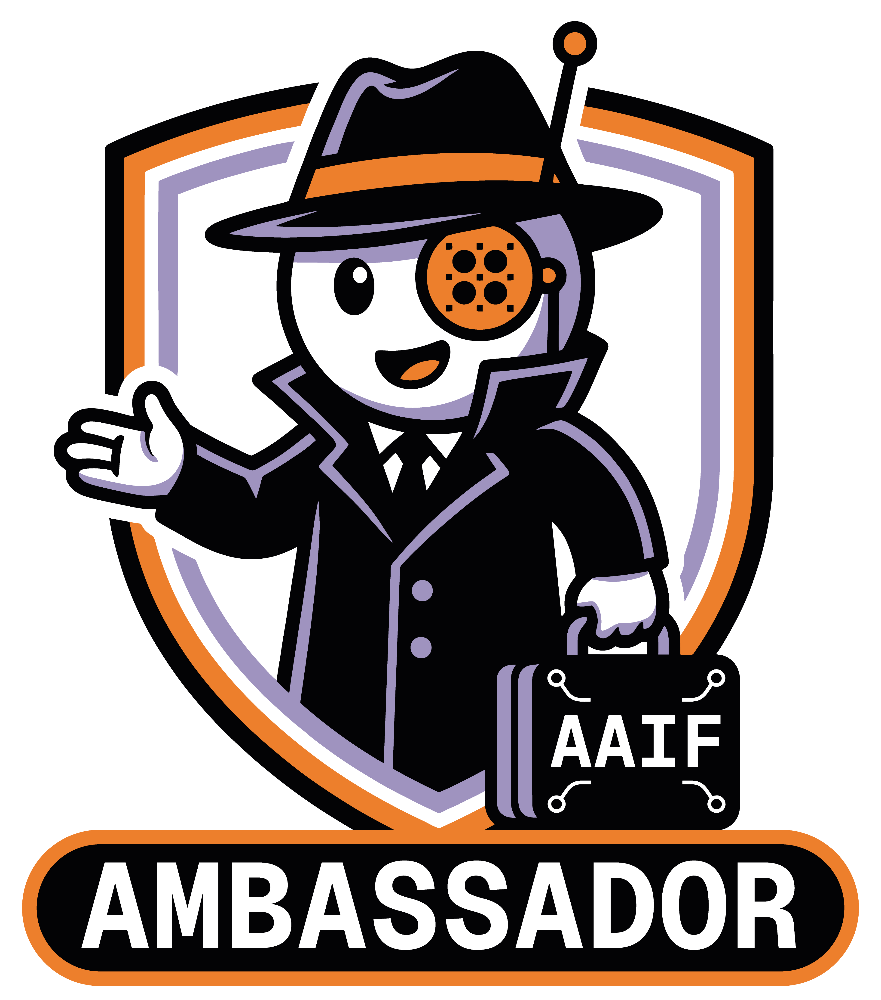

  

# AAIF Ambassador — Andrew Zigler

I'm a **2026 AAIF Ambassador** — part of the inaugural cohort of 138 developers
across 41 countries building, teaching, and advocating for open source agentic
AI. The [Agentic AI Foundation](https://aaif.io) (a Linux Foundation project) is
the neutral home for the standards behind agents:
**[MCP](https://modelcontextprotocol.io)**,
**[goose](https://goose-docs.ai)**,
**[AGENTS.md](https://agents.md)**, and
**[agentgateway](https://agentgateway.dev)**.

This repository is where I do that work **in the open** — the research, the
backlog, the harness I use to produce contributions, and the portfolio of what
I've shipped. The full cohort is at [aaif.io/ambassadors](https://aaif.io/ambassadors).

## Why this repo is public

Ambassadors commit to *"one public, project-based contribution per month"* and
to *"building in public."* I took that literally: the **system** I use to plan,
research, build, and verify those contributions lives here too — not just the
outputs. If you're figuring out how to contribute to agentic-AI open source (or
how to run an agentic harness that helps you do it), poke around.

It's also an honest demonstration of AAIF's own doctrine: *"We like agents. We do
not want agent slop."* Agents accelerate the work in here; every contribution
still passes a human-verification gate before it ships.

## What's inside

| Path | What it is |
|---|---|
| [`SUBMISSIONS.md`](SUBMISSIONS.md) | The portfolio — every contribution I've shipped, with links + points. |
| [`refs/`](refs/) | The research archive: the program handbook, per-project contribution-surface briefs, brand kit, and my "how to be a top ambassador" strategy. |
| [`submissions/`](submissions/) | One folder per contribution (drafts, code, assets). |
| [`CLAUDE.md`](CLAUDE.md) | The harness — how the agent + I run the submission pipeline. |
| [`.claude/practices.md`](.claude/practices.md) | The ambassador practice spec. |
| [`.beads/`](.beads/) | Task tracking (the idea backlog + work in flight). |

## The four projects (and where I'm contributing)

| Project | What it is | My angle |
|---|---|---|
| **AGENTS.md** | A README for coding agents (open standard, 60k+ repos). | My strongest lane — I author elaborate agent-guidance files; pattern catalogs + real annotated examples. |
| **MCP** | Open protocol connecting agents to tools & data. | I build MCP servers; tutorials + design/security patterns. |
| **goose** | Open-source, local-first AI agent. | Local models on real hardware; honest comparisons; recipes. |
| **agentgateway** | Unified gateway for MCP/LLM/agent traffic. | Self-hosted gateway ops; observability + security. |

## How the harness actually runs

Agents do a lot of the lifting in here, so the system is built to keep them
honest. Three moving parts:

### The skills

Each skill is a scoped, reusable procedure the agent loads on demand. They live
in [`.claude/skills/`](.claude/skills/):

| Skill | What it does |
|---|---|
| `submission` | The end-to-end pipeline for one contribution: pick → research → build → verify → publish → submit → log → amplify. |
| `research-paper` | The heavy long-form branch — a venue-neutral paper / whitepaper loop where every claim gets a grep-able test case, gated by a human review note. |
| `aaif-review` | Score-checks a finished piece (type, points, conformance) and drafts the exact submission issue — then stops at the human gate. |
| `camp-publish` | Lands a finished piece into my personal-site publish pipeline. |
| `aaif-radar` | A read-only weekly scan of the submissions landscape for trends and under-served lanes. Its report is private; nothing about other people is ever committed. |
| `agentgateway` | Read-only observability for a self-hosted agent gateway: audit, cost, trace, and human-gated hardening suggestions. |
| `aaif-blog-guidelines` | AAIF's own editorial + intake guidelines for blog content (authored by AAIF). |
| `aaif-brand-guidelines` | AAIF's own brand system for any branded visual or asset (authored by AAIF). |

### The loop state

Work is tracked, not remembered:

- **Beads** ([`.beads/`](.beads/)) — every idea, submission, and task is a
  tracked issue with a description, acceptance criteria, and status. `br ready`
  answers "what's next."
- **The session handoff** ([`refs/session-handoff.md`](refs/session-handoff.md))
  — a rotating note written at the end of each working session so the next one
  starts with full context.
- **The pulse ledger** ([`refs/pulse-ledger.jsonl`](refs/pulse-ledger.jsonl)) —
  an append-only record of autonomous loop ticks (like the weekly radar) and
  their outcomes, so nothing runs unaccounted for.

### The three hard gates

Some things an agent is never allowed to do on its own. These are enforced, not
suggested:

1. **The anti-slop gate.** No contribution ships until a human has verified the
   claims are accurate, the code runs, and it genuinely helps a developer. Agents
   are collaborators, not accountability shields.
2. **Never touch AAIF in public without me.** Agents draft and build freely, but
   nothing is submitted, opened, or posted to any AAIF surface without my explicit
   go-ahead, every time.
3. **No sizing up other people.** Nothing that names, ranks, or compares other
   participants is ever written into this repo. The framing is always the
   opportunity and the developer value — never a scoreboard.

## Connect

`2026 AAIF Ambassador · Advocating for open source agentic AI` ·
[@AgenticAIFdn](https://x.com/AgenticAIFdn) · `#AAIFAmbassador`

---

Built in the open. Agents help; I'm accountable for the result.
